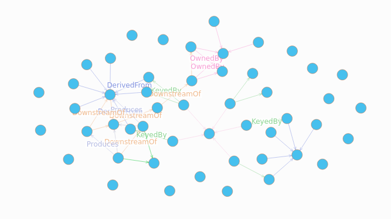

# Datahub on Dgraph

This branch provides a Dgraph implementation for `GraphService`, the only interface needed to connect DataHub
to a Dgraph cluster as its graph backend. The following steps set up a quickstart instance on your local machine.

## Build the project

Checkout the `datahub-on-dgraph`:

    git checkout datahub-on-dgraph

Build this project with Gradle. We skip tests for now:

    ./gradlew build

If you see this error:

    Required org.gradle.jvm.version '8' and found incompatible value '11'.

then you need to set `JAVA_HOME` to Java 8 first and try again:

    export JAVA_HOME=/usr/lib/jvm/java-8-openjdk-amd64
    $JAVA_HOME/bin/java -version

Next build and start all DataHub components from source with Dgraph backend:

    ./docker/dev-with-dgraph.sh

Once all services are up, start the DataHub CLI provided by the source project in a separate terminal
and ingest some sample data into DataHub:

    source metadata-ingestion/venv/bin/activate
    datahub docker ingest-sample-data

Now open up a web browser and go to Dgraph Ratel UI https://play.dgraph.io/?latest.

Alternatively, spin up your own Dgraph Ratel UI instance and go to http://localhost:8000/?local:

    docker run --rm -p 8000:8000 dgraph/ratel

Connect Ratel to Dgraph at http://localhost:8082 and run the following query.

```
query {
  nodes as var(func: has(<urn>))

  result (func: uid(nodes), first: 100, offset: 0) {
    expand(_all_) { <urn> <type> <key> }
  }
}
```

Switch from `JSON` to `Graph` view:


